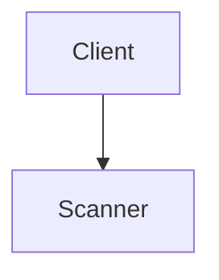
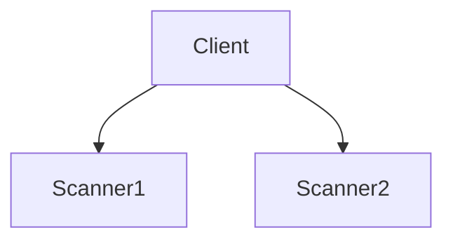
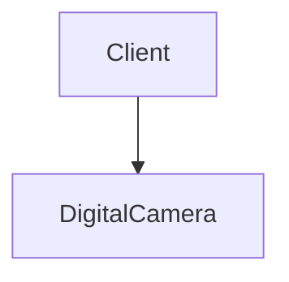
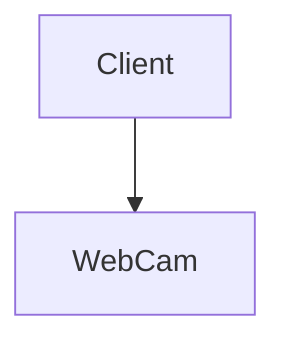
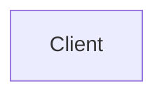

TP1 - UML : UML et Principes de POO
===

## Staticus, statica, staticum
### Question 1.1

<!-- Classes | Interfaces -->

- `Device` : Interface, ne contient qu'une commande register().
- `Client` : Classe contenant un attribut de type ImagingDevice.
- `ImagingDevice` : Interface qui étend l'interface Device, ne contient qu'une requête capture() et par définition la commande register().
- `Camera` : Classe abstraite qui implémente l'interface ImagingDevice dont la classe abstraite ou ses sous-classes doivent implémenter les méthodes non implémentées des interfaces et classes héritées. Ces méthodes sont les suivants :
  * register() depuis l'interface Device
  * capture() depuis l'interface ImagingDevice
  * setResolution(int) depuis la classe abstraite elle-même

  La classe abstraite :
    *  peut contenir des méthodes concrètes non final qui seront redéfinies par la ou les sous-classes
    *  peut contenir des méthodes non concrètes
    *  n'est pas instanciable

- `Scanner` : Classe qui implémente l'interface ImagingDevice donc doit implémenter exactement toutes les méthodes non implémentées des interfaces (Device et ImagingDevice). La classe contient en plus la commande warmup(). 
- `DigitalCamera` : Classe qui étend la classe abstraite Camera donc doit implémenter les méthodes non implémentées et issues des interfaces des classes abtraites héritées. Elle contient en plus la méthode (commande) setFlash(bool).
- `WebCam` : Classe qui étend la classe abstraite WebCam donc doit implémenter les méthodes non implémentées issues des interfaces et des classes abtraites héritées. De plus elle doit définir la commande setContrast(float).

### Question 1.2

- L'association `0..1`, peut se traduire par
  ```
  ImagingDevice device = null;
  ```
  ou par
  ```
  ImagingDevice device = new DigitalCamera();  // DigitalCamera est de type ImagingDevice et est instanciable
  ```
  La cardinalité `0..1` signifie que le client à en sa possession un unique périphérique ou aucun périphérique.

  * La classe ``Client01`` représente ce cas (La classe se trouve dans le répertoire response).

- La cardinalité `0..*` signifie que le client peut avoir zéro ou plusieurs périphériques. Cela peut se traduire en Java de la manière suivante :
  ```
  List<ImagingDevice> devices = new ArrayList<ImagingDevice>(); // Par défaut une liste vide de périphériques
  ```
  * La classe ``Client0N`` représente ce cas.
  
Les deux cas représentent la relation d'association.

### Question 1.3

- Le `type statique` représente le type connu dès la compilation du fichier, il s'agit du type donné par le programmeur.

- Le `type dynamique` représente le type connu dès l'exécution du programme. Le type dynamique est souvent un sous-type d'un type statique. Il s'agit d'un type exact.

Voici quelques moyens pour reconnaître le genre de type d'une variable : (moyen mnémotechnique)
* Le type fixé par le programmeur peut être associé à d'autre type sans que cela pose d'erreurs de compilation, il s'agira d'un type dynamique.
* Le type fixé par le programmeur à un type unique, on dira alors qu'il s'agit d'un type statique.

### Question 1.4

- Concernant le `type statique` associant à la variable appareil :
 * ImagingDevice pour la classe Client01
 * List<ImagingDevice> pour la classe Client0N

- Concernant le `type dynamique`, nous avons :
    * La classe DigitalCamera
    * La classe WebCam
    * la classe Scanner
 
### Question 1.5

* Cas 01
***
***



* Cas 0N
***
***







* Dans les deux cas
***
***



### Question 1.6

A partir de la variable appareil, on peut accéder, quel que soit le type dynamique aux méthodes register() et capture().

Selon les classes issus des types dynamique, on aura en plus leurs méthodes.
Depuis la classe Scanner, on aura accès aux méthodes suivantes : register(), capture() et warmup().
Depuis la classe WebCam, on aura accès aux méthodes suivantes : register(), capture(), setResolution(int) et setContrast(float).
Depuis la classe DigitalCamera, on aura accès aux méthodes suivantes : register(), capture(), setResolution(int) et setFlash(bool).

***
***

## Principes de base

### Question 2.1

Le contenu du répertoire poly a été récupéré. L'import a été fait.

### Question 2.2

Les paquetages sont les suivantes :
  * polynome
  * test
  * wonderland

Tous ces paquetages sont inclus dans le répertoire poly.

Les entités sont les suivants :
  * La classe Polynome
  * La classe Test
  * La classe WonderPlotCanvas (N'existe pas pour le moment)

Les relations sont les suivantes :
  * La composition depuis la classe Test vers la classe Polynome
  * La composition depuis la classe Polynome vers la classe WonderPlotCanvas


### Question 2.3

Les principes suivent l'acronyme SOLID
  * S pour `Single Responsability`
    Cela correspond au fait qu'une classe doit avoir une seule et unique responsabilité
    Dans notre cas :
    - la classe Polynome gère la notion de Polynome avec les calculs que cela engendre et elle utilise la classe WonderPlotCanvas permettant d'afficher le graphe résultant du polynôme.
    --> Je peux donc dire que la classe Polynome respecte ce principe

    - La classe Test gère les tests des spécification de la classe Polynome
    --> On peut donc dire que la classe Test respecte également ce principe

    - La classe WonderPlotCanvas n'existe pas

  * 0 pour `Open/Close`
    Cela signifie que les entités d'une application doit être ouvert en cas d'extension mais en cas de modification doit être fermée. Lorsqu'on souhaite corriger alors réouverture en extension. Si l'on souhaite apporter plus de fonctionnalité, de nouveaux besoins alors il est préférable de réaliser une nouvelle classe qui étend la précédente.

    --> Ce principe peut être enfreint car possibilité d'incompréhension et ou d'erreur humaine.

  * L pour `Liskov Substitution`
  
    ***
    ***
    *TODO* A faire
    ***
    ***

    Le sous-typage doit s'appliquer au TDA (Type de données abstraits)

  * I pour `Interface Segregation`
  Plusieurs types de clients impliquent plusieurs
interfaces !
  * D pour `Dependency Inversion`

Le programme pourrait enfreindre,

### Question 2.4

Il s'agit d'une relation d'héritage entre les classes Polynome et Monome.

### Question 2.5

Monome étend donc la classe Polynome car elle a le même comportement. La où est attendue la classe Polynome, la classe Monome peut y être associée. Lors du constructeur on doit ajouter comme paramètre du constructeur de la super-classe qu'est Polynome : Le tableau représentant le monome. Par exemple ceci représenterait

  ```
    {0.0, 0.0, 1.0}
  ```

le monome qui suit `x²`.

Cela est correct, mais cela ne respecte pas les principes énoncées plus tôt. Il ne s'agit pas de nouvelles fonctionnalité donc ne respecte pas le principe de Open/Close.

De plus la classe serait vide de méthode, ni de requêtes. Absence d'attributs. Cela montrerait une absence d'ajout de fonctionnalités.

De plus il n'a pas besoin d'un tableau contenant que des 0 avec comme dernier élément un 1.

### Question 2.6

Je dois donc redéfinir les méthodes suivantes dans la classe Monome :
- getDegree
- getCoefficient
- computeValue
- sum

Car on ajoute deux attributs absent au départ :
- coefficient
- degree

***
***
*TODO* A faire
**Réaliser le diagramme UML de la nouvelle architecture**

***
***

### Question 2.7


***
***
*TODO* A faire
***
***


### Question 2.8


***
***
*TODO* A faire
***
***


### Question 2.9


***
***
*TODO* A faire
***
***

